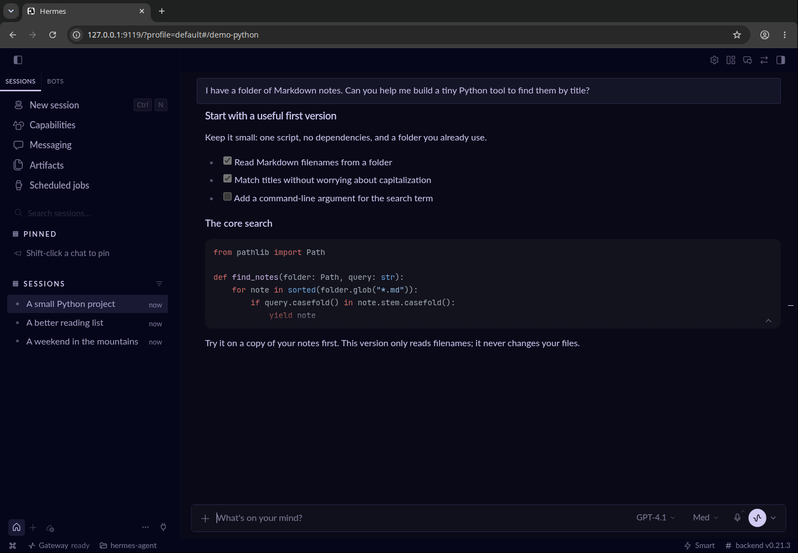

# Hermes Webdesktop

The [Hermes Desktop](https://hermes-agent.nousresearch.com/desktop), just running in your browser. No Electron or frontend build required. Unofficial project, obviously :-).

## Install

Requires Linux, a configured Hermes installation, and `curl`:

```sh
t=$(mktemp) && (trap 'rm -f "$t"' EXIT; status=$(curl -q --fail --silent --show-error --proto "=https" --max-time 60 --max-filesize 65536 --write-out "%{http_code}" https://raw.githubusercontent.com/melounvitek/hermes-webdesktop/main/install.sh -o "$t") && [ "$status" = 200 ] && sh "$t")
```

Run `hermes-browser start`, then open **http://127.0.0.1:9119/**. Press Ctrl-C to stop.

## Screenshot


