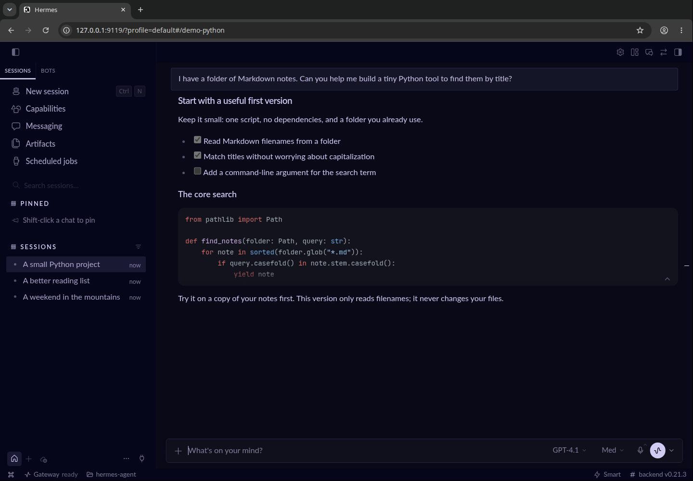

# Hermes Webdesktop

The [Hermes Desktop](https://hermes-agent.nousresearch.com/desktop), just running in your browser. No Electron or frontend build required. Unofficial project, obviously :-).

## Install

Requires Linux, a configured Hermes installation updated since 2026-10-07 (`hermes update`), and `curl`:

```sh
curl -qfsS --proto '=https' --max-time 60 --max-filesize 65536 https://raw.githubusercontent.com/melounvitek/hermes-webdesktop/main/install.sh -o hermes-browser-install.sh && sh ./hermes-browser-install.sh
```

Run this in a trusted, writable directory: it replaces `hermes-browser-install.sh`. The script runs only after curl succeeds; you must trust this repository. You can remove the downloaded file afterward.

Run `hermes-browser start`, then open **http://127.0.0.1:9119/**. Press Ctrl-C to stop.

## Browser build and updates

The footer shows the build loaded in this tab. Click it and press **Update**: the
launcher downloads the newest release, checks it against its published SHA-256
and switches to it without restarting Hermes. Reload each open tab afterwards:
until then a tab keeps the previous build and can fail to load parts of it that
it had not loaded yet.

Anyone who can use the web desktop can start an update. It only ever installs
the release published at the source the installer used, and it updates the
browser UI, not Hermes itself.

If the dialog says updating is unavailable, use the commands it shows:
`hermes-browser update` does the same from a terminal while the web desktop is
stopped. That is the case for installations made before updating from the
browser was added on 2026-10-04, and for profiles whose terminal backend is a
remote SSH host.

Updates replace the UI, not the launcher. To get a release that changes the
launcher, such as the one that added updating from the browser, stop the web
desktop, run `hermes-browser uninstall` and run the install command again.
Hermes and its data stay untouched.

The real installer and launcher were checked in Chromium against stock Hermes
`98d8ea79afce089c3ec35eb7f442daef485932b9`, on plain loopback and behind one
HTTPS port with the password login: an update switched the build without
restarting the dashboard process, and a release with a wrong checksum was
refused. This does not cover other Hermes revisions.

## Remote access

**Tailscale Serve is the recommended option:** it keeps access within your tailnet rather than exposing Hermes publicly. Use Serve, not Funnel.

Cloudflare Tunnel is an alternative if you need a public URL. Both can forward to `http://127.0.0.1:9119`; no separate `hermes serve` is needed.

We recommend a Hermes password with either option. Don’t expose a public endpoint without authentication.

In your Hermes profile’s `config.yaml`, merge these settings into the existing `dashboard` section:

```yaml
dashboard:
  public_url: "https://hermes.your-domain.com"
  basic_auth:
    username: "admin"
    password_hash: "<generated hash>"
    secret: "<generated secret>"
```

Use your actual Tailscale or Cloudflare HTTPS URL. Generate the hash and secret from your Hermes installation directory, with its Python environment activated:

```bash
python -c 'from getpass import getpass; from plugins.dashboard_auth.basic import hash_password; print(hash_password(getpass("Password: ")))'
python -c 'import secrets; print(secrets.token_urlsafe(32))'
```

Paste the outputs into the matching fields, then restart the browser launcher when no work is running.

**Don’t skip `public_url`:** on loopback, setting a password alone doesn’t require visitors to log in.

Open the public URL in a private browser window and confirm it requires login before showing your chats.

## Development

A normal clone includes the editable UI, tests and build configuration in
`source/`. No submodule or separate development repository is needed. The root
installer still downloads the prebuilt release; it does not build or install
anything from `source/`.

The current tree keeps the desktop/shared frontend, browser tooling and relevant
tests (including frontend dependency/security checks in `source/tests-js/`);
it does not contain the Hermes backend or other applications. Electron
code and the optional terminal plugin are retained. Native application packaging
is not supported by this repository's release workflow.

The renderer follows upstream `main` as of 2026-10-07, including Simple/Advanced mode,
custom model entry and additional languages. Native package installation/removal
remains unavailable in the browser. Account-wide connector management, which
stock Hermes now supports, has not been checked in the browser.
Session-based connectors retain compatibility with the tested stock backend.

The source came from a sanitized Git subtree import. Private plans, a historical
profile archive and credential examples were removed. See `SOURCE_PROVENANCE.json`.
Git history was not rewritten during extraction: older commits still contain the
full sanitized tree, so a normal clone retains that history's disk cost.

### Build and test

Use Linux, Node 22.22.1, npm 10.9.4, Python 3.11 and `uv`. Native npm dependencies
also need a C++ compiler, make and Python. From the repository root:

```bash
cd source
ELECTRON_SKIP_BINARY_DOWNLOAD=1 npm ci
npm run typecheck --workspace apps/desktop
npm run test:ui --workspace apps/desktop -- src/browser
npm run test:contracts
npm run build:browser --workspace apps/desktop
```

Edit `source/apps/desktop/src/`; the output is
`source/apps/desktop/dist-browser/`. Shared frontend code is in `source/apps/shared/`.
For wider UI coverage, omit `-- src/browser`. The October 7 update passes the
full UI suite. The plain desktop-workspace `dev` and `build` commands are for Electron,
not the browser edition. Generated frontend API contracts stay committed; updating
them is a separate compatibility task against stock Hermes.

To run the installer tests, from `source/`:

```bash
uv sync --locked --python 3.11
test_home=$(mktemp -d)
env -i HOME="$test_home" PATH="$PWD/.venv/bin:/usr/bin:/bin" \
  HERMES_TEST_FILE_RETRIES=0 \
  bash scripts/run_tests.sh -j 2
```

The default suite needs only the small test venv, not backend Python packages.
Tests use temporary profiles and loopback HTTPS, not your installed Hermes. They
need OpenSSL, curl and a PTY; install zsh to cover its installer cases too. The
published-distribution test installs and uninstalls the committed UI archive
without starting a backend.

### Try the UI

Use a separate, clean stock Hermes checkout and its Python environment. Do not
use `source/` as the backend or test against your real profile. This creates a
stock checkout at the current release's tested revision, disposable data and a
local fake model. No provider key is needed:

```bash
# From the repository root.
scratch=$(mktemp -d)
stock="$scratch/stock"
git clone https://github.com/NousResearch/hermes-agent.git "$stock"
git -C "$stock" checkout --detach 8a33891bdd58c3e0795ebfb277bcdde1003e91ea
UV_PROJECT_ENVIRONMENT="$scratch/venv" \
  uv sync --project "$stock" --locked --python 3.14 --extra web --no-install-project
python="$scratch/venv/bin/python"
mkdir "$scratch/home"
env -i HOME="$scratch/home" PATH=/usr/bin:/bin LANG=C.UTF-8 \
  PYTHONDONTWRITEBYTECODE=1 \
  "$python" source/apps/desktop/browser-spike/backend.py \
  --backend-root "$stock" --python "$python" \
  --web-dist "$PWD/source/apps/desktop/dist-browser"
```

Open the loopback URL in the `READY` line and try `spike: hello`. Rebuild the UI
and reload to check edits; Ctrl-C stops the fixture. Use a development account or
VM: disposable profiles do not make agent tools a security sandbox. Vite preview
alone does not provide the backend APIs or authentication setup.

The browser harness needs `/usr/bin/bwrap` with working PID/network namespaces.
From `source/`, run `npm run test:browser-compat:harness --workspace apps/desktop`
to check it. For the broader Chromium API checks, run
`npm run test:browser-compat --workspace apps/desktop --` followed by
`--backend-root`, `--python`, `--chrome`, `--web-dist` and a new `--evidence`
directory, all with absolute paths. The October 7 update passes all five
Chromium groups against the stock revision above, including syntax-highlighting
recovery, profile isolation and transcript freshness. File editing, conflict
handling and draft retention also pass separate Chromium checks. This does not
certify other backend revisions, physical mobile devices or external providers.

### Optional terminal plugin tests

The plugin is unchanged. Its integration suite is separate from installer tests
because it imports stock server/authentication/PTY modules. Against the stock
revision above it passes 16 of 18 cases; two job-cleanup cases fail in the
test's signal guard, as on the previous stock revision, and are not yet
investigated.
Using the disposable `scratch`, `stock` and `python` from above, after stopping
the UI fixture:

```bash
# From the repository root. Install test clients into the disposable stock venv.
uv pip install --python "$python" -r source/pyproject.toml --extra plugin
repo=$PWD
bwrap --unshare-net --unshare-pid --die-with-parent \
  --ro-bind / / --tmpfs /tmp --bind "$scratch" "$scratch" \
  --ro-bind "$stock" "$stock" --ro-bind "$repo" "$repo" \
  --bind "$repo/source" "$repo/source" --proc /proc --dev /dev \
  --chdir "$repo" \
  env -i HOME="$scratch/home" PATH=/usr/bin:/bin:/usr/sbin:/sbin \
  HERMES_PYTHON="$python" HERMES_TEST_FILE_RETRIES=0 \
  bash source/scripts/run_tests.sh -j 1 tests/plugins/test_browser_terminal_plugin.py \
  -- --backend-root="$stock"
```

This starts disposable loopback servers and shells in a private network/PID
namespace. It neither installs the plugin into your profile nor changes the
stock checkout. `HERMES_PYTHON` explicitly selects the integration interpreter
even when `source/.venv` exists. The backend must be a clean Git checkout with
no root `.env`; a missing or invalid selection fails rather than using an
installed runtime. Read-only host files remain visible inside the namespace.

### Release files

Source changes do not update the published bundle. `hermes-browser.py pack`
requires a verification receipt for the exact tested UI bytes; it does not run
tests. Its module documentation describes the receipt fields. Never reuse a
previous receipt for a new build or mark a failed gate as passed.

`prepare-browser-distribution.py --help` describes how to package a verified
archive and its matching launcher into a new output directory. Use an explicit
`--source` URL. Keep root installer scripts in sync with `source/scripts/` when
changing them, and update `SHA256SUMS` for changed distribution files. Do not
replace the current release during ordinary source work. Check the existing
release with `sha256sum --check SHA256SUMS` from the repository root.

## Screenshot


